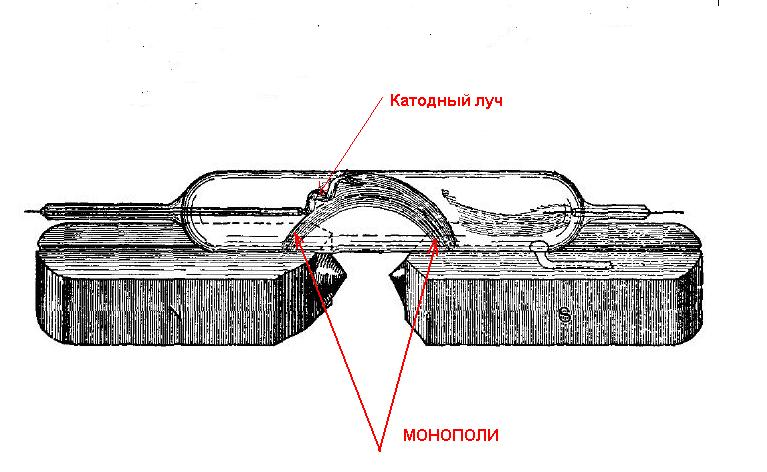
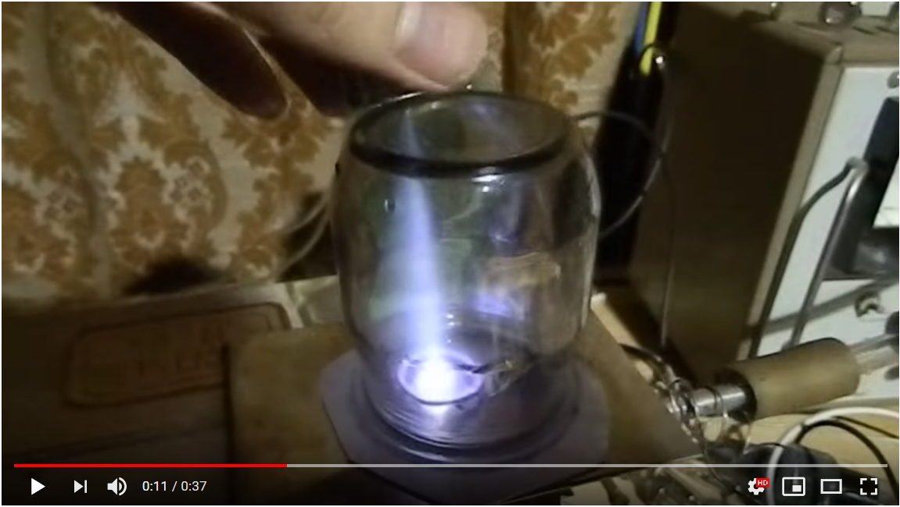
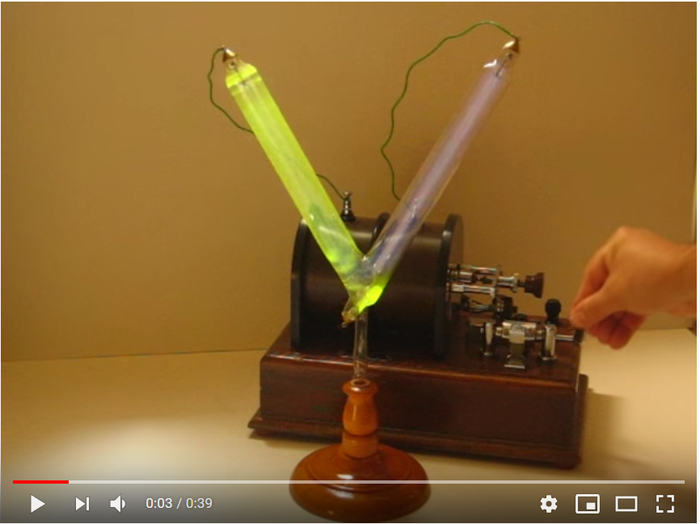
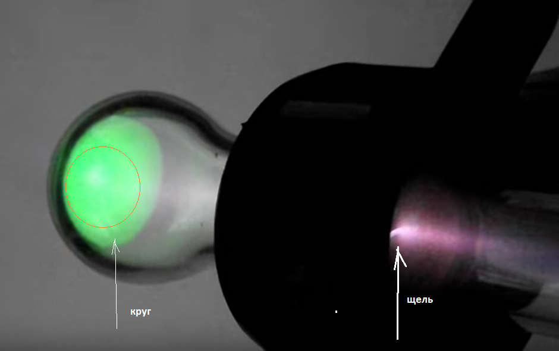
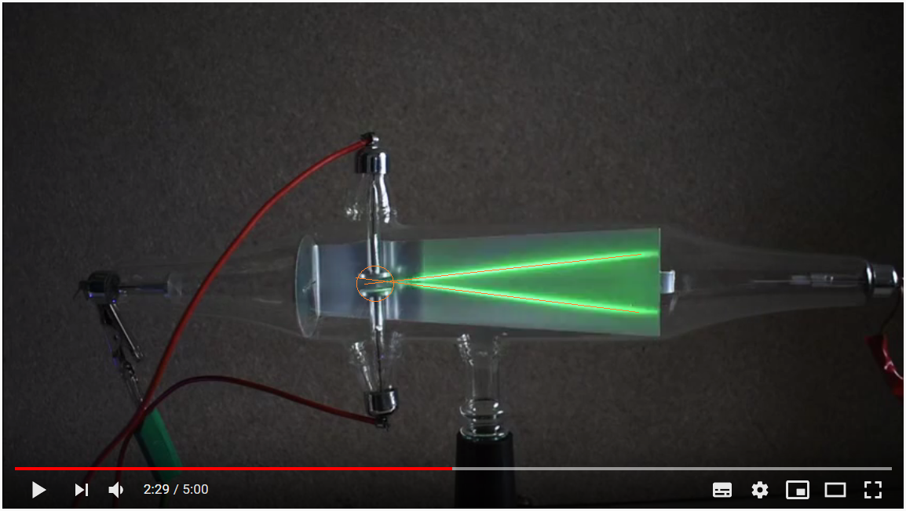
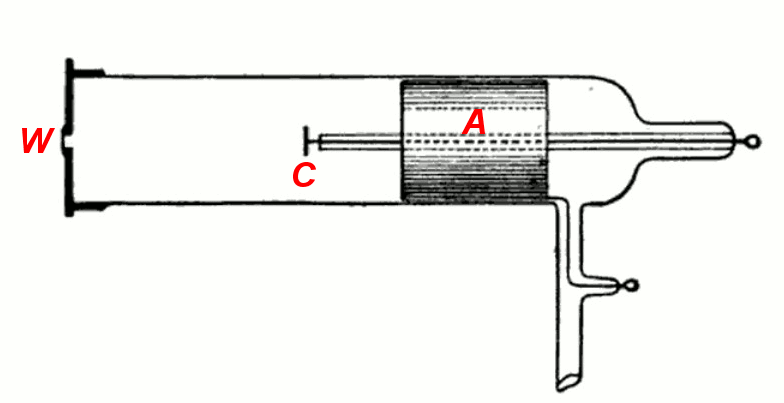
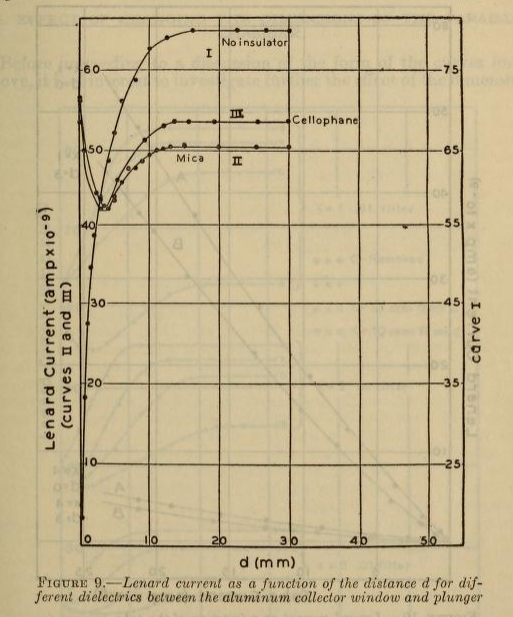

# Magnetic-Monopoles
Experimental picture magnetic monopoles.

Широко известный ГИТТОРФ (Hittorf), Иоганн Вильгельм в 1869 г. 
обнаружил (первооткрыватель) как катодные лучи так и магнитные лучи. Описал их свойства. Все его
труды, даже пионерские по катодным лучам, изъяты из публичного доступа.

видео https://www.youtube.com/watch?v=7psjUJTKpIM

Плазма в ртутном газотроне NL-615, реакция на магниты

https://www.youtube.com/watch?v=RNPp-U-RVwI

https://www.youtube.com/watch?v=QyurmRvFFYo

Дополнительно 
https://www.youtube.com/watch?v=c89AQ0W18is

"темная материя"

https://www.youtube.com/watch?v=EiYsS7xXXq4

https://www.youtube.com/watch?v=IVTA6moqVEM

активация уранового стекла колбы в месте тени от мальтийского креста х-лучами или неизвестными лучами
вследствии чего после опрокидывания креста место тени светится гораздо ярче
https://www.youtube.com/watch?v=Xt7ZWEDZ_GI

https://www.youtube.com/watch?v=nNS_GofE704

странный нагрев катодными лучами

https://www.youtube.com/watch?v=KwxUrTqzsTE

здесь нагревание происходит сфокусированными анодными лучами

https://www.youtube.com/watch?v=jQuP256wC3s

закатодные лучи

https://www.youtube.com/watch?v=5DSfoheskto

Teltron Vacuum Tube

https://www.youtube.com/watch?v=wWXWDZk7ABc

отклонения катодных лучей в поле между обкладками конденсатора

https://www.youtube.com/watch?v=o69t9QNhOOM

Discharge tube producing X-rays

https://www.youtube.com/watch?v=bqWD8kOQsZw

Трубка Ленарда и исследование свойств катодных лучей выходящих из окна этой трубки

https://archive.org/details/measurementoflen71573tayl/page/67?q=Lenard+Ray

исходя из кривой 1, измерение тока без изолятора однозначно следует что катодные лучи не имеют электрического заряда,
это чисто нейтральные лучи но которые особо взаимодействуют с магнитным полем.

https://www.youtube.com/watch?v=bqWD8kOQsZw

https://www.youtube.com/watch?v=5DSfoheskto

https://www.youtube.com/watch?v=813-2aAJ300

https://www.youtube.com/watch?v=Q6NPQ_9Kbj8

https://www.youtube.com/watch?v=1XHHkiZLVpM

https://www.youtube.com/watch?v=4Rb0RNK_DCE

https://www.youtube.com/watch?v=gh6G4xynKxs

https://www.youtube.com/watch?v=c89AQ0W18is

https://www.youtube.com/watch?v=5oNHU6a2veA

https://www.youtube.com/watch?v=W6AUq9u4qDg

https://www.youtube.com/watch?v=MaBTef3k_HE

https://www.youtube.com/watch?v=nwRBlyZcNso

https://www.youtube.com/watch?v=KwxUrTqzsTE

5:33 Монополи

https://www.youtube.com/watch?v=PVh-Pyv00bU

simple magnetron effect
Простой магнетрон, верхний электрод - анод (+), а нижний алюминиевый диск - катод (-), ниже которого находится тороидальный ферритовый магнит с цилиндрическим неодимом в центре, изолированным от его внутренних стенок. ,
10 кВ 100 мбар

https://www.youtube.com/watch?v=hBacVnxZOfI

Demonstration of magnetron plasma

https://www.youtube.com/watch?v=fDdAbFP7TtE

https://www.youtube.com/watch?v=URJxfXMv9OU

https://www.youtube.com/watch?v=0d6chzb7Z1c

14:37 на середину магнита

https://www.youtube.com/watch?v=qRl0jAtoLeo

DC Plasma with focalisation magnet

https://www.youtube.com/watch?v=g443hlJO4bA

Плазменный тюнер, тест с внутренней полярностью N-N на магнетроне.
Тест на магнитное удержание плазмы с полярностью N-N во внутренних перегородочных магнитах на магнетроне для ускорения процесса.
Явление происходит, но с меньшей интенсивностью, чем с противоположными полярностями (S-S), из-за полярности ограничиваемых частиц (+)
мощность: 10 кВ
давление: 90 мбар

https://www.youtube.com/watch?v=oz04vQp9xVU

Удерживающие катионы через сильное магнитное поле сталкиваются с внутренними полярностями Юг-Юг.
В верхней части анодный электрод (+) и в нижней части катодный алюминиевый диск (-), в его средней части 2 колонки по 9 неодимовых магнитов в каждой, с противоположными полярностями. (Юг-Юг). В этом тесте видно, что это явление происходит с большей интенсивностью, чем с противоположными полярностями, и, обходясь без нижнего магнетрона, вы сможете лучше оценить различные поляризованные области и их разную окраску.
Мощность: 10кв
давление: 90 мбар

https://www.youtube.com/watch?v=zcd7TSvK7PY
